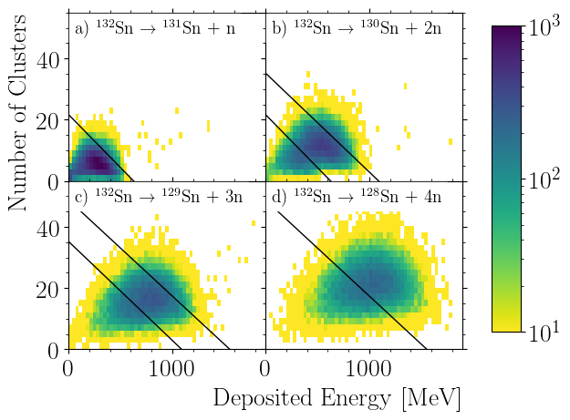

# NeuLAND Sn-132
## Simulated detector response and calorimetric event reconstruction for the breakup of Sn-132 into one to six neutrons and a heavy fragment

NeuLAND, the New Large Area Neutron Detector, is a part of the [Reactions with Relativistic Radioactive Beams (R3B)](https://www.gsi.de/en/work/research/nustarenna/nustarenna_divisions/nuclear_reactions/r3b_project_group.htm) experiment at the [Facility for Antiproton and Ion Research (FAIR)](https://en.wikipedia.org/wiki/Facility_for_Antiproton_and_Ion_Research), the *Universe in the Laboratory*, which is currently under construction in Darmstadt, Germany. It detects neutrons emitted in nuclear reactions to investigate the origin of matter in the cosmos, the properties of exotic isotopes far away from stability, and more.

NeuLANDs main purpose is to determine the **mulitplicity** (= number) and the precise **energy** of the neutrons emitted in the nuclear reaction of interest. Modules of the detector, called **doubleplanes**, are each constructed with 250cm long [plastic scintillator](https://en.wikipedia.org/wiki/Scintillator) bars with a square profile of 5cm, where 50 bars are aligned horizontally and 50 vertically. Incoming neutrons interact with this material, and the resulting charged secondary particles deposit energy, which is converted to light. At each end of bar, a photomultiplier detects the emitted light, and from its arrival time and amplitude, the position within the bar can be calculated. Such a position-time-energy tuple is called a **hit**. From the **first interaction** of the neutron, its energy can be precisely calculated with the Time-of-Flight method. As a neutron can randomly undergo a large variety of different reactions, the **hit pattern** in the detector look vastly different, and **reconstruction** of the first interaction point can be difficult.


In this JupyterLab repository, we explore the performance of one reconstruction method, formerly called the **TDR method**, with **simulated data**. This reconstruction method is to a large part centered around **calorimetric** properties of the detector, i.e., detecting the neutron's converted kinetic energy. The simulations are performed with [R3BRoot](https://github.com/R3BRootGroup/R3BRoot), which is based on the [FAIRRoot framework](https://github.com/FairRootGroup/FairRoot), which in turn utilized [Geant4](https://geant4.web.cern.ch/) for the particle transport and [ROOT](https://root.cern.ch/) for data handling. Note that we here use the automatically generated Python integration ROOT provides.


Performance depends on many factors:

- The **distance** from target to detector. Larger distance means a longer flight time, which translates a more accurate Time-of-Flight measurement.
- The **number of doubleplanes**. More double planes both increase the interaction probability of an incoming neutron as well as the amount of energy particles deposit in the detector.
- The **energy** of the incoming neutron: With more kinetic energy, different and more violent reaction types occur with changing probability, leading to different hit patterns.
- The **relative energy** of the neutrons, which roughly translates into how far the different neutrons are apart from each other when they hit the detector. If they are close together, their hit patterns may overlap too much to deduce the individual first interactions points.
- The **number of neutrons** - the more neutrons impinge on the detector, the harder it is to tell how many they were and how to tell them apart.
- Lastly, the simulation can use different **physics models** for the interaction of particles in the detector.


The range of options explored here is:
```python
distances = [15, 35]  # meters
doubleplanes = [8, 12, 20, 30]
energies = [200, 600, 1000]  # in MeV
erels = [100, 500, 1000, 2000, 3000]  # in keV
neutrons = [1, 2, 3, 4, 5, 6]
physicss = ["bert", "bic", "inclxx"]
```

The simulation, data processing, reconstruction, and visualization steps are separated into different notebooks:

- [Step 0: Single Simulation](00-single-simulation.ipynb) runs a short simulation for demonstration and testing.
- [Step 1: Simulate](01-simulate.ipynb) runs a simulation for each of the 2160 individual parameter combinations.
- [Step 2: Digitize](02-digitize.ipynb) applies the detector response to the simulated data
- [Step 3: Calorimetric Method](03-calorimetric-method.ipynb) trains (calibrates) the reconstruction algorithm. Multiplicty separation matrices are created and the respective balance accuracy score are calculated.
- [Step 4: Reconstruct](04-reconstruct.ipynb) the calibrated algorithm is applied to produce histograms, which are fitted to produce several figures and values.
- [Track Visualization](TrackVisualization.ipynb) creates track pictures.
- [Calibr Visualization](CalibrVisualization.ipynb) creates pictures from the calibrated calorimetric multiplicity method.


